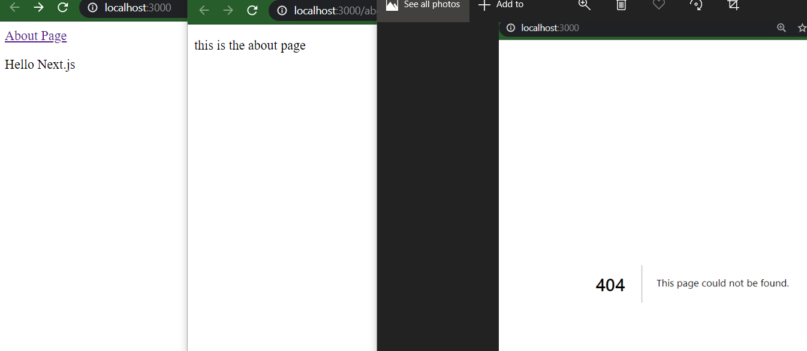
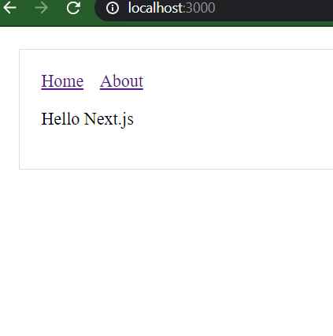
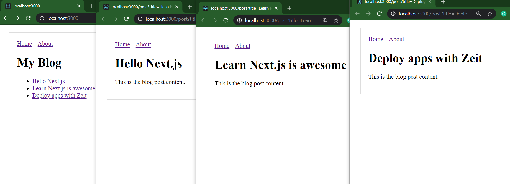
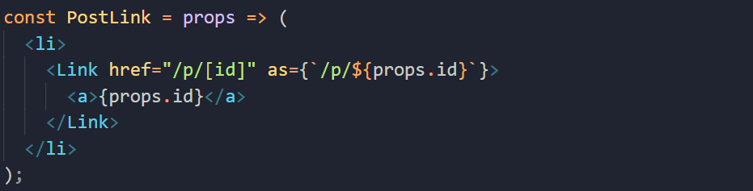
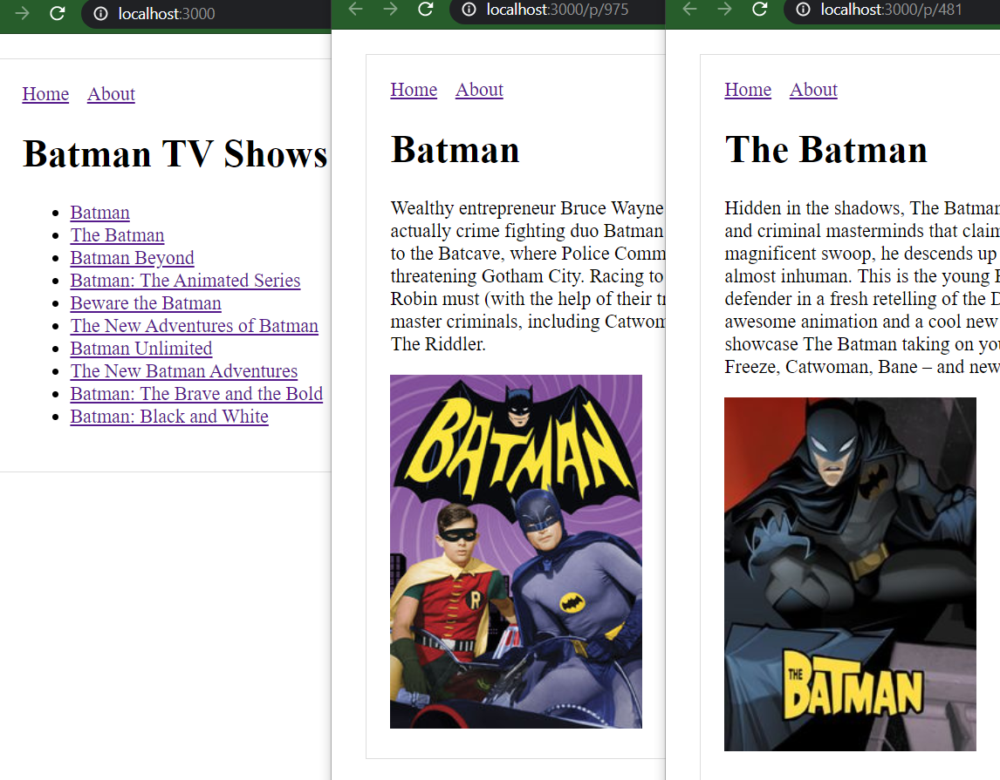
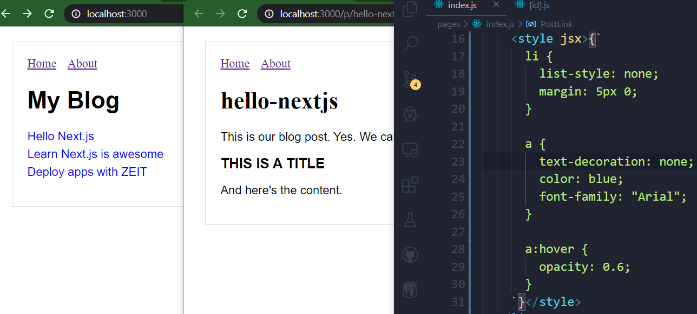
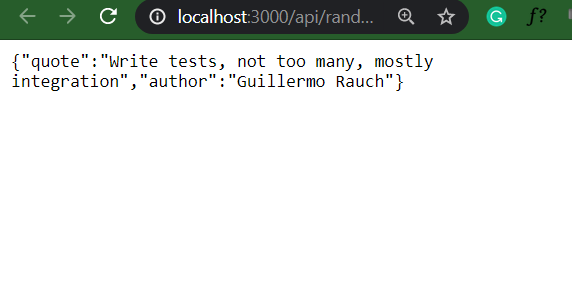
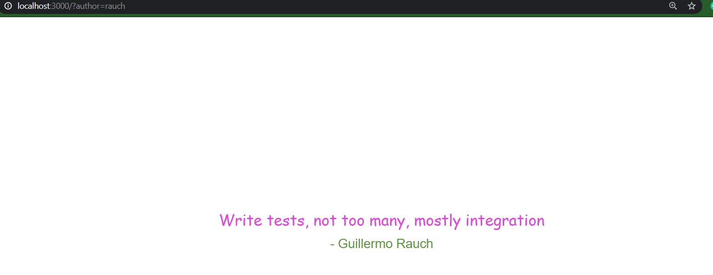
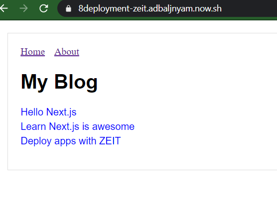

# nextjs-all-in

<h3> Try official guide: </h3><a href="https://nextjs.org/learn/basics/getting-started"> TUTORIALS IN NextJS</a>

<h1>NextJS</h1>

<ul>
<li>1.Navigation</li>
<li>2.Shared components</li>
<li>3.Create Dynamic pages</li>
<li>4.Routing</li>
<li>5.Fetching</li>
<li>6.Styling</li>
<li>7.API routing</li>
<li>8.Deploying</li>
</ul>

<strong>1.Navigation</strong>
</img>
<strong>2.Shared components</strong>
</img>
<strong>3.Create Dynamic pages</strong>
</img>
<strong>4.Routing</strong>
</img>
<strong>5.Fetching</strong>
</img>
<strong>6.Styling</strong>
</img>
<strong>7.API routing</strong>
</img>
</img>
<strong>8.Deploying</strong>
 
</img>
